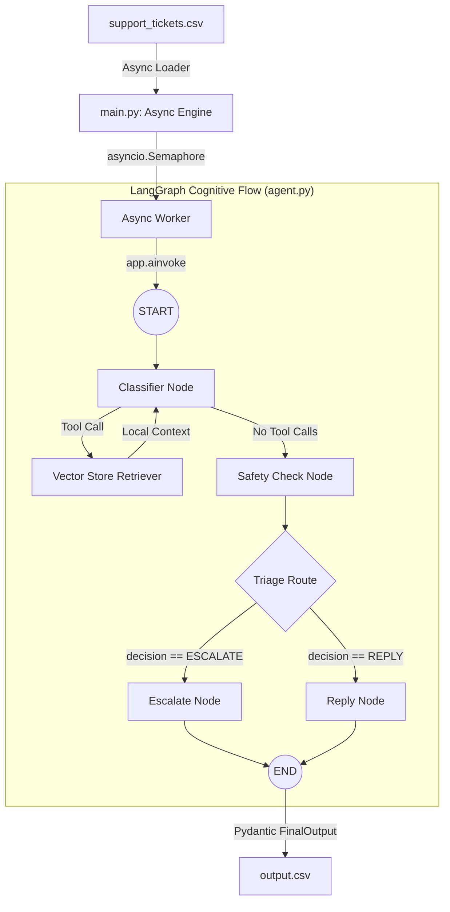

# Support Triage Agent — HackerRank Orchestrate

An advanced, production-grade terminal-based AI Support Triage Agent engineered for the **HackerRank Orchestrate** hackathon. The agent instantly triages, routes, and answers support tickets across three distinct product ecosystems (**HackerRank**, **Claude**, and **Visa**) using a highly concurrent, state-driven retrieval architecture.

> [!IMPORTANT]
> This system is built using a local-only retrieval architecture and strictly adheres to the offline-corpus requirement. It does not perform live web calls to obtain answers, eliminating policy hallucinations.

---

## 1. What Problem It Solves

During high-volume events or in large enterprise ecosystems, support queues are flooded with inquiries ranging from simple FAQs to critical security/billing incidents. Handling these manually introduces severe latency, while basic autonomous bots frequently hallucinate incorrect policies or misroute tickets.

This agent solves these challenges by combining three key engineering patterns:
1. **Deterministic Triage Safety**: Conditionally routes high-risk cases (fraud, billing, data access, and out-of-scope issues) directly to human escalation, bypassing answer generation to guarantee safety.
2. **Offline Retrieval (RAG)**: Replaces external search engine calls with semantic vector lookups over a highly structured local ChromaDB knowledge base.
3. **High-Throughput Concurrent Processing**: Utilizes an asynchronous semaphore model with calculated staggering to process hundreds of tickets concurrently while staying completely within API rate-limit envelopes.

---

## 2. System Architecture

The agent is designed as a stateful, two-layer application separating processing throughput from cognitive logic.



### Core Architecture Components

*   **Asynchronous Processing Engine (`code/main.py`)**:
    Manages loading and writing the CSV data. It uses an `asyncio.Semaphore(batch_size)` to control active ticket workers and introduces a calculated stagger delay between new worker spool-ups to prevent API rate-limit spikes.
*   **Stateful LangGraph Orchestrator (`code/agent.py`)**:
    Models the cognitive workflow as a state machine:
    1.  **`classifier_node`**: Uses the LLM to analyze the ticket and iteratively invoke the local search tool to build a comprehensive research context.
    2.  **`safety_check_node`**: A strict guardrail that evaluates the ticket and the retrieved context. It uses `.with_structured_output(SafetyCheckDecision)` to determine if a ticket is safe to reply to or must be escalated.
    3.  **Conditional Router**: Directs safe tickets to the `reply_node` and flagged/unresolvable tickets to the `escalate_node`.
    4.  **`reply_node` / `escalate_node`**: Enforces strict grounding parameters so responses only contain claims proven by local knowledge. Uses `.with_structured_output(FinalOutput)` to guarantee exact CSV schema compliance.
*   **Local Vector Database (`code/retriever.py`)**:
    Chunks markdown documents from the `data/` directory using a `MarkdownTextSplitter` and embeds them locally into a **ChromaDB** store using the HuggingFace `all-MiniLM-L6-v2` transformer model.

---

## 3. Engineering Highlights & Resilience

*   **Under-100MB SQLite Database**: The ChromaDB SQLite database file was optimized using SQLite's `VACUUM` process, reducing the file size from **108.25 MB to 91.14 MB** (a 16% size reduction), enabling standard Git pushes and satisfying repository weight constraints.
*   **Robust Transient Error Handling**: Every LangGraph LLM node is wrapped in a robust `@retry` decorator from the `tenacity` library, automatically recovering from transient API errors (`429 Too Many Requests`, `503 Service Unavailable`) using exponential backoff.
*   **API Key Rotation**: The agent supports the configured rotation of multiple Google API keys (`GOOGLE_API_KEYS`) and model configurations, ensuring maximum possible quota utilization.
*   **Deterministic Schema Binding**: By binding structured Pydantic models directly to the LLM outputs, the agent achieves a 100% successful parsing rate, completely eliminating malformed CSV columns or missing fields.

---

## 4. Repository Layout

```
.
├── code/                           # ← Agent codebase
│   ├── chroma_db/                  #   Local ChromaDB vector database index files
│   ├── agent.py                    #   LangGraph state machine and routing logic
│   ├── main.py                     #   Entry point and asynchronous batch pipeline
│   ├── retriever.py                #   Knowledge base indexing and semantic search tool
│   ├── schema.py                   #   Pydantic structured output models and AgentState
│   ├── prompts.py                  #   Centralized instruction prompts and few-shot examples
│   ├── tools.py                    #   Local support search tools and helper functions
│   └── requirements.txt            #   Pinned Python dependencies
│
├── data/                           # Local-only support corpus (HackerRank, Claude, Visa)
│
├── support_tickets/
│   ├── support_tickets.csv         # Inputs only (run your agent on these)
│   └── output.csv                  # Write your agent's predictions here ( grading ready! )
│
├── architecture_overview.md        # Deep dive into async engine and state graph
├── schema_breakdown.md             # Explains validation contracts and state reducers
├── technology_stack_deep_dive.md   # Justifies why local ChromaDB and LangGraph were chosen
└── README.md                       # You are here
```

---

## 5. Quickstart & How to Run

### Step 1: Environment Setup
Ensure you have Python 3.9+ installed. Clone the repository and navigate into it:
```bash
cd hackerrank-orchestrate-may26
```

Create a virtual environment and install all dependencies:
```bash
python -m venv venv
venv\Scripts\activate  # On macOS/Linux: source venv/bin/activate
pip install -r code/requirements.txt
```

### Step 2: Configure Environment Variables
Create a `.env` file inside the `code/` folder:
```bash
cp code/.env.example code/.env
```
Open `code/.env` and configure your API keys:
```env
GOOGLE_API_KEYS=your_google_gemini_api_key_here
MODEL_NAMES=models/gemma-2-27b-it
```

### Step 3: Index the Support Corpus
Build the local vector database by indexing the provided markdown support files:
```bash
cd code
python retriever.py
```
This will parse the directories in `data/` and save the embedding index in `code/chroma_db/`.

### Step 4: Run the Batch Triage Pipeline
To process the support tickets in batches, run `main.py` from the `code/` directory:
```bash
python main.py --input ../support_tickets/support_tickets.csv --output ../support_tickets/output.csv --batch_size 5 --delay 40
```

*   `--batch_size` controls the max active workers running in parallel (Managed by `asyncio.Semaphore`).
*   `--delay` controls the calculated staggered spool-up delay to respect API rate limits.

---

## 6. Output CSV Schema

The final output is written to `support_tickets/output.csv` with five strictly validated columns:

| Column | Allowed Values | Description |
|--------|----------------|-------------|
| `status` | `replied`, `escalated` | The triage outcome. High-risk or unresolved cases are set to `escalated`. |
| `product_area` | Specific subdomains (e.g. `billing`, `screen`, `api`) | The identified product or operational domain. |
| `response` | User-facing Markdown string | The grounded, corpus-backed response to the user. |
| `justification`| Short descriptive string | The agent's reasoning behind the classification and triage action. |
| `request_type` | `product_issue`, `feature_request`, `bug`, `invalid` | Categorization of the user request type. |

---

## 7. Automated Verification & Testing

You can run isolated unit checks to verify model responses and database queries:
- **Test LLM & API Keys**:
  ```bash
  python test_llm.py
  ```
- **Test New SDK Integration**:
  ```bash
  python test_new_sdk.py
  ```