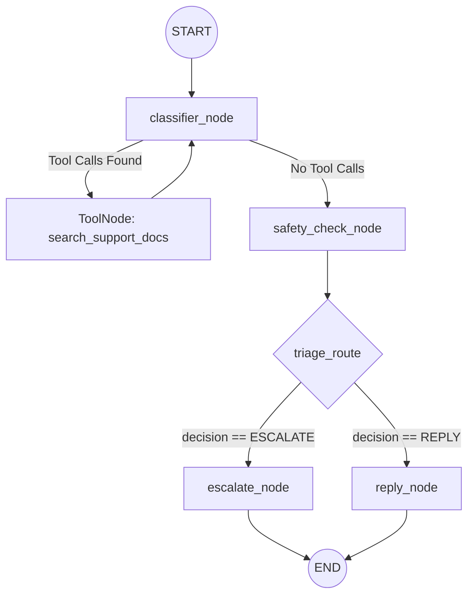

# Project Architecture Overview

Your Support Triage Agent is built on a highly concurrent, state-driven architecture. The system is split into two primary layers: the **Asynchronous Processing Engine** (`main.py`) which manages throughput, and the **LangGraph State Machine** (`agent.py`) which manages the cognitive workflow of the LLM.

Below is a detailed breakdown of how the entire system operates.

---

## 1. Asynchronous Processing Engine (`main.py`)

The entry point of your application is designed to handle large CSV datasets (`support_tickets.csv`) quickly without overwhelming the system or hitting API rate limits instantly.

*   **Concurrency Control**: It uses `asyncio.Semaphore(batch_size)` to enforce a strict limit on how many tickets are processed simultaneously. 
*   **Staggered Execution**: Rather than dumping all requests at once, it calculates a smooth stagger delay (`stagger = delay_seconds / batch_size`) and uses `asyncio.sleep` to gradually spool up workers. This prevents "burst" rate limiting from the Google Generative AI API.
*   **Fault Tolerance**: If an individual worker encounters an unrecoverable exception, it catches the error and yields a `get_fallback_output()` dictionary (escalating with a `SYSTEM_FAILURE` status) rather than crashing the entire batch process.

## 2. The LangGraph State Machine (`agent.py`)

Once a ticket enters processing, it is passed into the LangGraph workflow (`app.ainvoke(initial_state)`). The graph maintains an `AgentState` object containing the ticket details, conversation history (messages), triage decision, and final research context.

### The Workflow Diagram



### Node-by-Node Breakdown

1.  **`classifier_node`**: 
    *   This is the initial entry point. The LLM (Gemini) is injected with the `CLASSIFIER_PROMPT`. 
    *   It does *not* answer the user directly. Its sole job is to analyze the ticket and use the `search_support_docs` tool to gather context from your local ChromaDB. 
    *   It loops back and forth with the `tools` node until it is satisfied it has enough information to proceed.

2.  **`safety_check_node`**:
    *   Once retrieval is complete, the graph extracts the formatted documentation into a clean `research_context` string.
    *   The LLM is prompted with `SAFETY_CHECK_PROMPT`, acting as a triage manager.
    *   It reviews the ticket against strict escalation rules (fraud, billing, account access, missing docs).
    *   **Structured Output**: It uses `.with_structured_output(SafetyCheckDecision)` to strictly return a parsed Pydantic object containing the `decision` (REPLY or ESCALATE), `justification`, `request_type`, and `product_area`.

3.  **Triage Router (Conditional Edge)**:
    *   Reads the `triage_decision` from the state. Routes to `escalate_node` if high-risk, otherwise routes to `reply_node`.

4.  **`escalate_node` & `reply_node`**:
    *   These are the final generation steps. They use `ESCALATE_GENERATOR_PROMPT` and `RESPONSE_GENERATOR_PROMPT` respectively.
    *   They are explicitly instructed to use *only* the retrieved context, preventing hallucination.
    *   **Structured Output**: Both use `.with_structured_output(FinalOutput)` to enforce that the final LLM response perfectly matches the required 5-column CSV schema (`status`, `product_area`, `response`, `justification`, `request_type`).

## 3. Resilience and Retry Logic

Every single LLM node in `agent.py` is wrapped in a robust `@retry` decorator powered by the `tenacity` library:

```python
@retry(
    stop=stop_after_attempt(5),
    wait=wait_exponential(multiplier=2, min=10, max=120),
    before_sleep=before_sleep_log(logger, logging.WARNING),
    reraise=True,
)
```

**Why this matters:** When processing hundreds of tickets, API transient errors (like `503 Service Unavailable` or `429 Too Many Requests`) are inevitable. Instead of failing the ticket, your nodes will automatically pause, wait exponentially (10s, 20s, 40s, up to 120s), and try again up to 5 times. 

## 4. Prompt Engineering (`prompts.py`)

The architecture cleanly separates prompt logic from execution logic. You have distinct personas for distinct graph nodes:
*   `CLASSIFIER_PROMPT`: Acts as a researcher, instructed *not* to answer, only to search.
*   `SAFETY_CHECK_PROMPT`: Acts as a manager, holding strict rules on what constitutes an escalation. Provides Few-Shot examples to guide classification.
*   `RESPONSE_GENERATOR_PROMPT`: Acts as the final agent, with strict constraints against hallucination and inventing policies.
